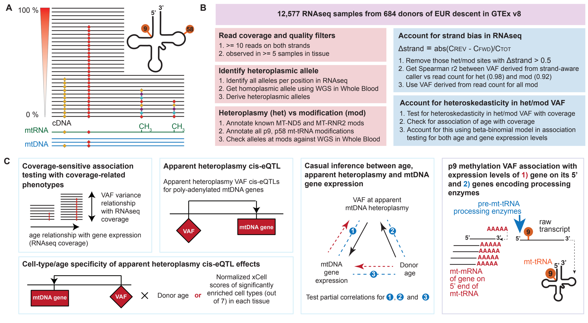

# mtDNA-heteroplasmy

# Description

This repository contains the code required to reproduce the analysis presented in the manuscript **"Tissue-specific apparent mtDNA heteroplasmy and its relationship with ageing and mtDNA gene expression"** by Wengert et al., which is currently under revision. You can access our preprint [here](link-to-paper). 

Below, you can find a conceptual overview of the project and the analyses conducted for this study:




# Code usability and data access

The scripts in this repository work as part of a larger analysis pipeline, but may require minor adjustments to run on different systems. We also do not provide individual level data (either raw data or processed data as part of our project) in any part of our repository, these would have to be obtained through gaining [approved access with GTEx](https://gtexportal.org/home/protectedDataAccess). As such, scripts provided here are not intended to run as is but for demonstration of our analyses.
      
   * [Descriptive analysis](#Descriptive-analysis)

   * [Model evaluation](#Model-evaluation)

   * [Donor age testing](#Donor-age-testing)

   * [mtDNA cis-eQTL](#mtDNA-cis-eQTL)
   
   * [Mediation analysis](#Mediation-analysis)

   * [Transcript processing analysis](#Transcript-processing-analysis)


# Obtain mtDNA alignments from bulk RNAseq/WGS data and perform variant calling 

1. We obtain reads mapping to the rCRS mtDNA reference genome [NC_012920 ](https://www.ncbi.nlm.nih.gov/nuccore/251831106) (which is part of the human [hg38 reference genome](https://www.ncbi.nlm.nih.gov/datasets/genome/GCF_000001405.26/)) using [samtools](https://www.htslib.org/), using flag [-F 3852](https://broadinstitute.github.io/picard/explain-flags.html) to select only the reads that do not fall under the following categories: read unmapped (0x4), mate unmapped (0x8), not primary alignment (0x100), read fails platform/vendor quality checks (0x200), read is PCR or optical duplicate (0x400), supplementary alignment (0x800). 
   
```
samtools view -b -F 3852 $file.bam -o $file.mtdna.bam chrM
samtools index $file.mtdna.bam
``` 
2. We perform variant calling using [mtDNA-server](https://github.com/seppinho/mutserve?tab=readme-ov-file) for each sample individually, then combine the variant calls to form our variant call set, using the [rCRS.fasta](https://raw.githubusercontent.com/seppinho/mutserve/master/files/rCRS.fasta) file as reference. 
```
reffile="rCRS.fasta"
java -jar mutserve-1.3.0.jar analyse-local --input $file.mtdna.bam --reference $reffile --level 0.01 --output $file.mtdna.var.txt 
```

# Variant data filtering and processing

We perform the following steps for apparent heteroplasmy variant filtering and processing, all scripts for these steps are in the ```scripts/preprocessing``` directory 

1. concatenating and preprocessing of raw variant call files from mtDNA-server, as shown in  ```1_variant_files_preprocessing.R```
2. identifying the likely inherited allele using the homoplasmic alleles in each individual at each apparent heteroplasmic position, using variant calls from WGS in Whole Blood, as shown in ```2_wgs_alleles.R```
3. applying quality control filters on apparent heteroplasmy calls, as shown in ```3_variant_filters.R```
4. apply cohort filters to identify common apparent heteroplasmies with adequate variance between individuals for association testing, as shown in ```4_cohort_filters.R```
5. add in cohort annotations, as shown in ```5_cohort_annotations.R```
6. prepare apparent heteorplasmy genotype files for association testing, as shown in ```6_prep_het_genotype_file.R```
7. identify cell types with high median xCell scores per tissue for use in celltype interaction a analyses, as shown in ```7_celltype_proportions.R```

# Landscape of apparent mtDNA heteroplasmy and enrichment testing in CNS tissues 

We perform the following explorations for the landscape of mtDNA heteroplasmy and mtRNA modifications in 49 tissues in GTEx v8, as shown in the ```scripts/landscape``` directory 

1. identification of numbers and median variant allele frequencies of mtDNA heteroplasmy and mtRNA modifications across donors in each tissue
2. identification of transitions and transversions in mtDNA heteroplasmy
3. identification of putative inherited/somatic nature mtDNA heteroplasmy through looking into the number of tissues they occur in as described in [An et al Nat Genet 2024](https://www.nature.com/articles/s41588-024-01838-z) 
4. obtaining associations between putative inherited/somatic nature mtDNA heteroplasmy and median mtDNA copy number (mtDNA-CN) as previously established in [Rath et al PNAS 2024](https://www.pnas.org/doi/10.1073/pnas.2402291121)
5. checking for tissue occurrence of pathogenic mtDNA heteroplasmy at mt.3243A>G as reviewed in [Gomes et al Hum Mol Genet 2021](https://doi.org/10.1093/hmg/ddab156), previously associated with various clinical phenotypes ranging from severe MELAS to mild deafness and glucose intolerance
6. enrichment testing of occurrence of mtRNA modifications in CNS tissues

1-5 are detailed in ```landscape_explorations.R``` and 6 is detailed in ```cns_enrichment.R```

# Evaluation of association testing models for RNAseq derived apparent heteroplasmy 

- brief explanation
- code: 
    1. `2024_04_28_derive_simulation_params.R`
    2. `2023_11_22_betabinomial_heteroplasmy_simulations.ipynb`
    3. `2023_12_13_model_assessment_simulations.R`

# Donor age association testing

- brief explanation
- code:
    1. `2023_06_15_lm_analytical_all_tissues.R`
    2. `2024_24_28_LM_A_qc_plots.R`
    3. `2023_09_15_bb_permutations_per_tissue.R`
    4. `2023_07_14_BB_fit_analytilcal_pvals.R`
    5. `2023_07_14_BB_calc_empirical_pvals.R`
    6. `2023_08_07_BB_annotate_results.R`
    7. `2023_08_28_donor_age_model_diagnostics.R`
    8. `2024_06_19_donor_age_cell_type_interaction.R`
    9. `2023_07_15_plot_pheno_tests`

# Apparent heteroplasmy eQTL  

- brief explanation
- code: 
    1. `2024_06_13_regress_out_peer_factors_from_gene_expression.R`
    2. `2023_06_19_lm_cis_eQTL_analytical_all_tissues.R`
    3. `2024_24_28_cis_eQTL_LM_A_qc_plots.R`
    4. `2023_08_03_BB_permutations_per_tissue.R`
    5. `2023_08_08_BB_cis_eQTL_analytical_all_tissues.R`
    6. `2023_08_08_BB_calc_empirical_pvals.R`
    7. `2023_08_10_cis_eQTL_merge_and_annotate_results.R`
    8. `2023_08_10_cis_eQTL_model_diagnostics.R`
    10. `2024_06_17_ciseQTL_cell_type_interaction_analysis.R`
    11. `2024_06_18_cell_type_fractions_per_tissue.R`
    xx. `2024_08_14_sanity_check_file_ids.R`
    12. `2023_08_01_plot_mol_test.R`

# Mediation analysis between apparent heteroplasmy, mtDNA gene expression and donor age 

- brief explanation
- code:
    1. `2024_04_02_mediation_analysis.`
    2. `2024_09_23_dono_age_logTPM_interaction.R`

# mt-tRNA modification roles in transcript processing 

- brief explanation
- code:
    1. `2024_10_01_select_tissue_sample_pos_bamfiles.R`
    2. `slurm_submit.py`
    3. `slurm_build_tissue_command.sh`
    4. `2024_09_25_count_reads_at_cutsites.py`
    5. `2024_09_28_sample_level_summary_reads_at_cutsites.R`
    6. `2024_08_23_qc_descriptive_sample_level_read_summaries.R`
    7. `2024_11_18_replication_analysis.R`
    8. `2024_11_18_position_level_analysis.R`
    9. `2024_11_18_sample_level_analysis.R`
    10. `2024_10_03_mt_transcript_lengths.R`

# Contact

We are grateful for any feedback or questions about the analysis code! 

- **Coding-Related Questions:**  
  If you have questions or encounter issues with the code, please submit an issue via `github`.

- **Scientific Correspondence:**  
    For scientific correspondence please reach out directly to:

  - Simon Wengert: [simon.wengert@helmholtz-munich.de](mailto:simon.wengert@helmholtz-munich.de)  
  - Dr. Na Cai: [na.cai@helmholtz-munich.de](mailto:na.cai@helmholtz-munich.de)


## Licensing

This project is licensed under the MIT License. However, the authors respectfully request that it be used only for non-commercial purposes, unless prior written consent is obtained.

### What this means

- **Non-commercial use** includes academic research, educational projects, personal experimentation, and open collaboration.
- **Commercial use** includes, but is not limited to:
  - Use within a for-profit entity (e.g., private companies, corporate labs).
  - Redistribution of the software for monetary gain.
  - Embedding the software in a product or service that is sold or licensed.

If you wish to use this software for commercial purposes, please contact the authors to discuss licensing terms.

